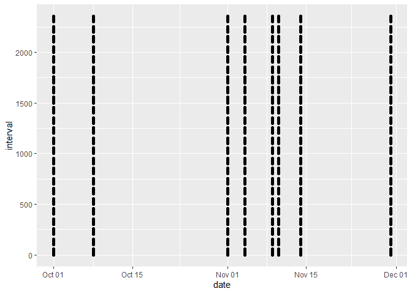

This is an analysis of [data set](https://d396qusza40orc.cloudfront.net/repdata%2Fdata%2Factivity.zip).
The first step is to load the data and get prepared for analysis.

## Loading and preprocessing the data

```r
# load packages
library(lubridate)
```

```
## Warning: package 'lubridate' was built under R version 4.3.1
```

```
## 
## Attaching package: 'lubridate'
```

```
## The following objects are masked from 'package:base':
## 
##     date, intersect, setdiff, union
```

```r
library(ggplot2)
```

```
## Warning: package 'ggplot2' was built under R version 4.3.1
```

```r
library(dplyr)
```

```
## 
## Attaching package: 'dplyr'
```

```
## The following objects are masked from 'package:stats':
## 
##     filter, lag
```

```
## The following objects are masked from 'package:base':
## 
##     intersect, setdiff, setequal, union
```

```r
# unzip and read the data into data frame
fname <- "activity.zip"
unzip(fname)

df <- read.csv("activity.csv")
df$date <- ymd(df$date)
```


## What is total number of steps taken per day?
This is the first question to answer.  Short answer and some observation as below.

- 13% data is missing
- Segment of observation with 0 steps as daily total
- Maximum is more than 20,000 steps
- Daily median is 10,395 and mean is 9,354


```r
print(mean(is.na(df$steps)))
```

```
## [1] 0.1311475
```

```r
a0 <- with( df, tapply(steps, date, sum, na.rm = T))
a0 <- data.frame( date = names(a0), sum = a0)

ggplot(a0, aes(x = sum)) + geom_histogram() + labs( x ="Steps per day", y = "Count during two months")
```

```
## `stat_bin()` using `bins = 30`. Pick better value with `binwidth`.
```

<!-- -->

```r
summary(a0$sum) %>% print()
```

```
##    Min. 1st Qu.  Median    Mean 3rd Qu.    Max. 
##       0    6778   10395    9354   12811   21194
```

## What is the average daily activity pattern?

Activity pattern is shown below and maximum is 206 steps in average


```r
a1 <- with(df, tapply(steps, interval, mean, na.rm = T))
a1 <- data.frame( interval = names(a1), ave = as.numeric(a1))
ggplot(a1, aes(x = interval, y = ave, group = 1)) + geom_line() + theme( axis.text.x=element_blank()) + labs( x = "Interval Index", y = "Average steps")
```

<!-- -->

```r
filter(a1, ave == max( ave))
```

```
##   interval      ave
## 1      835 206.1698
```

# Imputing missing values

Firstly, take a look at the pattern of NA.  It looks like NA is concentrate specific date but no dependency to the interval.


```r
b0 <- filter(df, is.na(steps))
ggplot(b0, aes(x = date, y = interval)) + geom_point()
```

<!-- -->

Now, idea is to replace missing data by the average per interval per days (as people behavior could depend on day and time)


```r
df$weekdays <- weekdays(df$date)
b1 <- array2DF( with( df, tapply( steps, list(weekdays, interval), mean, na.rm = T)))
names(b1) <- c("days", "interval", "ave")

df$steps_wo_NA <- df$steps

for(i in 1:nrow(df)){
        if( is.na(df[i,"steps_wo_NA"])){
                d <- df[i, "weekdays"]
                t <- df[i, "interval"]
                df[i, "steps_wo_NA"] <- filter(b1, days == d & interval == t)$ave
        }
}
```

Let's look at histogram with missing data imputed. Daily median and mean are now 11,015 and 10,821.


```r
a2 <- with( df, tapply(steps_wo_NA, date, sum, na.rm = T))
a2 <- data.frame( date = names(a2), sum = a2)

ggplot(a2, aes(x = sum)) + geom_histogram() + labs( x ="Steps per day", y = "Count during two months")
```

```
## `stat_bin()` using `bins = 30`. Pick better value with `binwidth`.
```

<!-- -->

```r
summary(a2$sum) %>% print()
```

```
##    Min. 1st Qu.  Median    Mean 3rd Qu.    Max. 
##      41    8918   11015   10821   12811   21194
```

# Are there differences in activity patterns between weekdays and weekends?

Lastly, this is activity patterns for weekdays and weekends.


```r
df$days = "weekday"
df[ weekdays(df$date) == "Sunday" | weekdays(df$date) == "Saturday", "days"] <- "weekend"

a3 <- array2DF( with(df, tapply(steps_wo_NA, list( days, interval), mean)))
names(a3) <- c("days", "interval", "ave")
ggplot(a3, aes(x = interval, y = ave, group = 1)) + facet_grid( rows = vars(days)) + geom_line(na.rm = T) + theme( axis.text.x=element_blank())
```

<!-- -->
